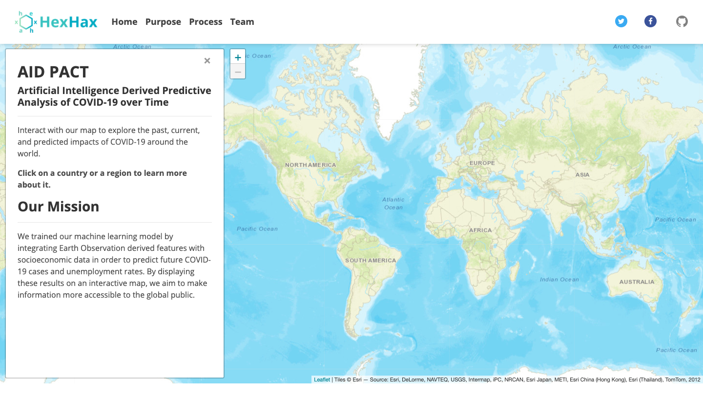

# AID PACT: Artificial Intelligence Derived Predictive Analysis of COVID-19 over Time
## Summary
Our interactive map displays current and AI-predicted future COVID-19 cases and unemployment rates over time. Using a Bayesian Ridge Regression, we trained our machine learning model by integrating Earth Observation derived features and socioeconomic data. By providing these location-based predictions, we hope to help the public make better-informed decisions regarding safety.

## Demo
An interactive demo website can be found here: https://hexhax.herokuapp.com/

## Datasets used
* Global COVID-19 Data: https://ourworldindata.org/coronavirus-source-data
* US State Specific COVID-19 Data: https://usafacts.org/visualizations/coronavirus-covid-19-spread-map/
* Global Accessibility to Cities: https://malariaatlas.org/research-project/accessibility_to_cities/
* US Unemployment: https://oui.doleta.gov/unemploy/claims.asp
* Global Human Modification: https://developers.google.com/earth-engine/datasets/catalog/CSP_HM_GlobalHumanModification#description
* GINI Index: https://data.worldbank.org/indicator/SI.POV.GINI?view=map
* Global Population Density: https://developers.google.com/earth-engine/datasets/catalog/CIESIN_GPWv411_GPW_UNWPP-Adjusted_Population_Density#bands
